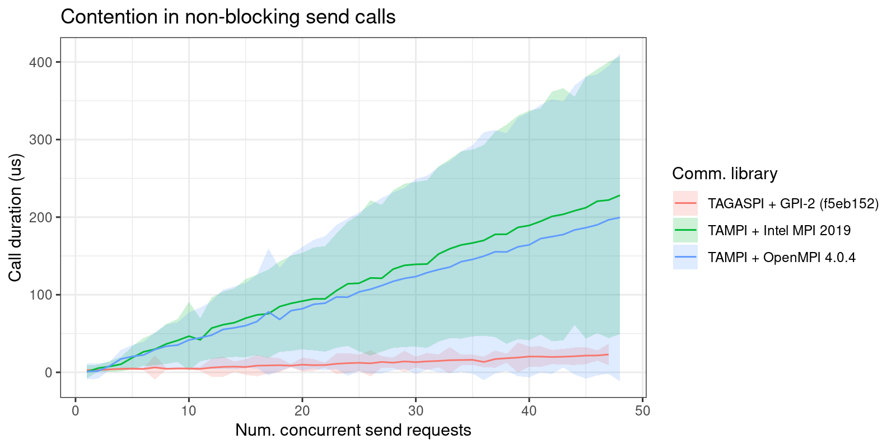

# Tsunampi: micro-benchmark for concurrent communications

Author: Rodrigo Arias Mallo <rodrigo.arias@bsc.es>

Date: 2022-04-11

The *tsunampi* benchmark stresses concurrent requests in communication
libraries.

The tool performs batches of *2N* iterations with *C* concurrent tasks
continuously performing send and recv calls to obtain *N* samples of
each. Each sample measures the duration of the communcation call when
the library was called by exactly *C* tasks, otherwise the sample is
discarded. The tool perform enough batches to obtain *N* samples. The
number of samples can be varied with the `-n` option.

The mean and standard deviation of the *N* samples for each value of
concurrent tasks *C* is reported as a table, both for the send and
receive operations.

The following variants are implemented:

- TAMPI: Uses two-sided non-blocking `TAMPI_Isend` and `TAMPI_Irecv`.
- TAGASPI: Uses one-sided `tagaspi_write_notify` and `tagaspi_notify_async_wait`.

NOTE: The TAGASPI variant is very quick to perform the wait operation,
so it is often not possible to quickly arrive to a high number of
concurrent calls. Use `-s` to measure only the duration of send calls.

Example plot for Intel MPI, OpenMPI and TAGASPI send operations, with
the standard deviation around the mean:

